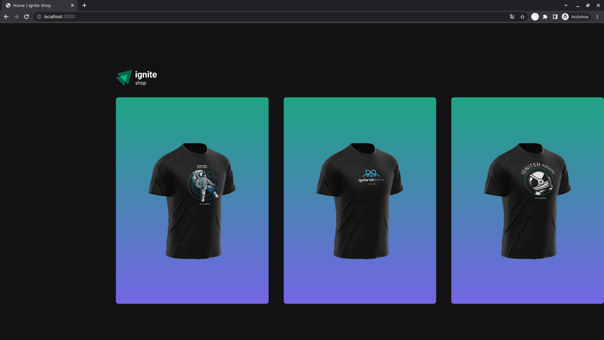

## Ignite Shop

<h1 align="center">
    
</h1>

Ignite Shop é uma aplicação Web desenvolvida com Next.Js (Versão 13) que tem como objetivo ser um e-commerce de venda de camisas. O sistema conta com a utilização da API do Stipe, uma ferramenta que serve para toda financeira de vendas... inclusive os produtos que estão cadastrasdos nessa API são carregadas diretmante na aplicação desenvolvida.

## Aprendizados

No desenvolvimento da aplicação foram abordados temas como Fundamento dos Next.js (Como trabalhar com imagens, Data Fetching e Estruturas de pastas), Integração com a API do Stripe, SSG, SEO e API Router.

### Stack utilizada

**Front-end:** React.JS, Next.JS, Typescript, Axios e Stripe.

### Funcionalidades

- Mostrar dados dos produtos cadastrados no Stripe
- Redirecionamentos de páginas e rotas

### Requisitos para rodar a aplicação

Antes de sair clonando e rodando a aplicação, é necessário ter uma conta cadastrada no Stripe e preencher os dados em um arquivo .env.local com as chaves Publicas e Secretas.

## Rodando o Projeto

Clone o projeto

```bash
  git clone https://github.com/diego64/ignite-shop
```

Entre no diretório do projeto

```bash
  cd ignite-shop
```

Instale as dependências

```bash
  npm install
```

Inicie o servidor

```bash
  npm run dev
```